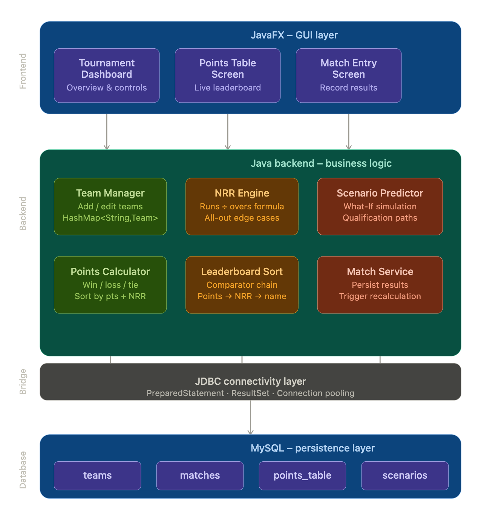
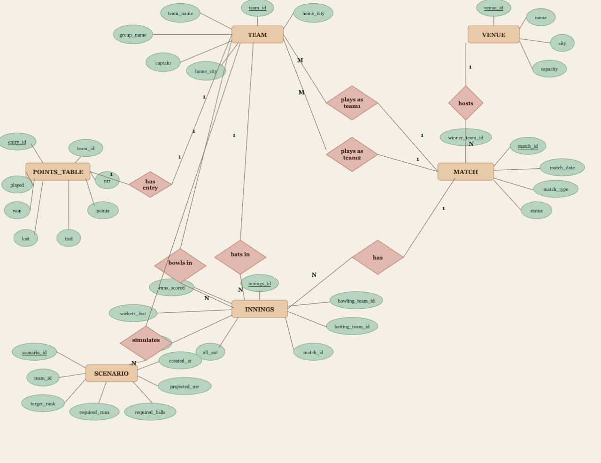
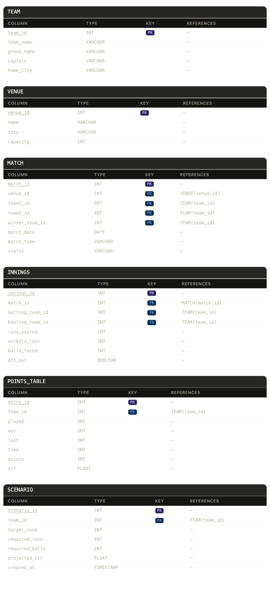

# 🏏 T20 Cricket Tournament Simulator & Qualification Calculator

A Java-based system to simulate T20 tournaments, manage match results, calculate points tables, Net Run Rate (NRR), and predict qualification scenarios.

---

## 🧠 System Architecture

This project follows a layered architecture:

### 🔹 Frontend (JavaFX - GUI Layer)

* Tournament Dashboard → Overview & controls
* Points Table Screen → Live leaderboard
* Match Entry Screen → Record match results

### 🔹 Backend (Java - Business Logic)

* Team Manager → Manage teams
* Points Calculator → Win/Loss/Tie logic
* NRR Engine → Accurate NRR calculation
* Leaderboard Sort → Points → NRR → Name
* Match Service → Store results & trigger updates
* Scenario Predictor → Qualification simulations

### 🔹 Bridge Layer

* JDBC Connectivity
* PreparedStatement, ResultSet
* Connection Pooling

### 🔹 Database (MySQL)

* teams
* matches
* points_table
* scenarios

---

## 📊 ER Diagram

---

## 🗂️ Database Schema

---

## 🚀 Features

* Add and manage teams
* Record match results
* Auto-update points table
* Net Run Rate (NRR) calculation
* Leaderboard sorting
* Qualification scenario prediction

---

## 🛠️ Tech Stack

* **Frontend:** JavaFX
* **Backend:** Java
* **Database:** MySQL
* **Connectivity:** JDBC

---

## 📌 Project Status

🚧 Currently in initial phase

* README + Design completed
* Frontend & Backend implementation coming next

---

## 💡 Future Enhancements

* Full GUI implementation (JavaFX)
* REST API integration
* Advanced analytics & predictions
* Deployment

---
