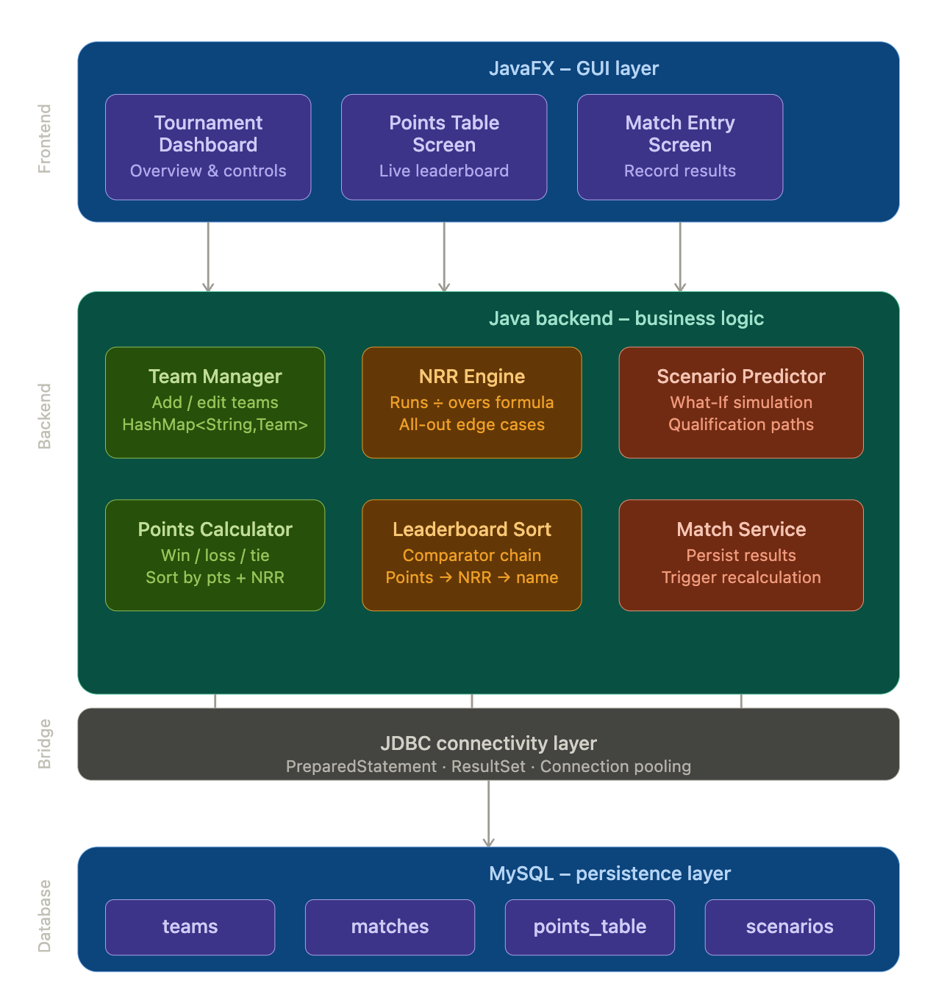
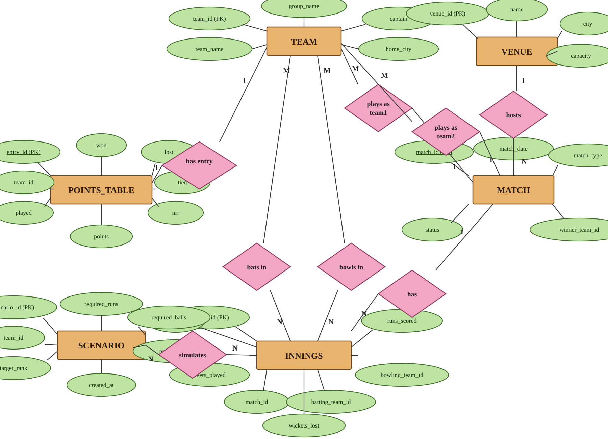
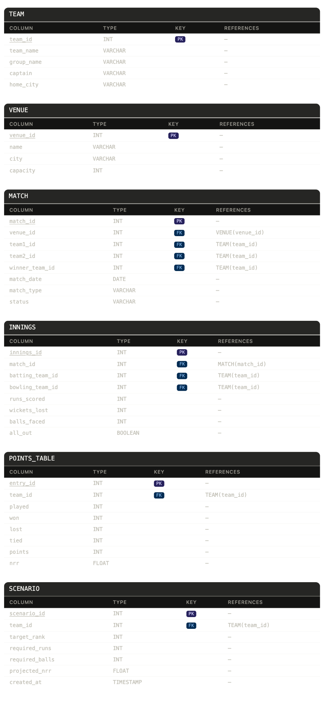

# 🏏 T20 Cricket Tournament Simulator & Qualification Calculator

A Java-based system to simulate T20 tournaments, manage match results, calculate points tables, Net Run Rate (NRR), and predict qualification scenarios.

## Project Structure

```text
src/main/java/com/t20simulator/
├── dao
├── db
├── model
├── service
└── ui

src/main/resources/
├── config.properties
└── db/schema.sql
```

---

## 🧠 System Architecture



This project follows a layered architecture:

### 🔹 Frontend (Java Swing - GUI Layer)

* `MainFrame` → Single `JFrame` with `JTabbedPane`
* `DashboardPanel` → Stats + add team/venue dialogs
* `MatchEntryPanel` → Match result form
* `PointsTablePanel` → Leaderboard + qualification predictor

### 🔹 Backend (Java - Business Logic)

* Team Manager → Manage teams
* Points Calculator → Win/Loss/Tie logic
* NRR Engine → Accurate NRR calculation
* Leaderboard Sort → Points → NRR → Name
* Match Service → Store results & trigger updates
* Scenario Predictor → Qualification simulations

### 🔹 Bridge Layer

* JDBC Connectivity
* PreparedStatement, ResultSet
* Connection Pooling

### 🔹 Database (MySQL)

* teams
* venues
* match_table
* innings
* points_table
* scenarios

---

## 📊 ER Diagram



---

## 🗂️ Database Schema



---

## 🚀 Features

* Add and manage teams
* Record match results
* Auto-update points table
* Net Run Rate (NRR) calculation
* Leaderboard sorting
* Qualification scenario prediction

---

## 🛠️ Tech Stack

* **Frontend:** Java Swing (`javax.swing`, `java.awt`)
* **Backend:** Java
* **Database:** MySQL
* **Connectivity:** JDBC

---

## ⚙️ Setup

1. Create the database objects from [schema.sql](/Users/ayush/T20-Cricket-Tournament-Simulator-Qualification-Calculator/src/main/resources/db/schema.sql).
2. Update [config.properties](/Users/ayush/T20-Cricket-Tournament-Simulator-Qualification-Calculator/src/main/resources/config.properties) with your MySQL username and password.
3. Make sure Java 17+ is installed.
4. Compile and run:

```bash
javac -d out $(find src/main/java -name '*.java')
java -cp out com.t20simulator.ui.MainFrame
```

The application opens with:

* Dashboard tab
* Match Entry tab
* Points Table tab

---

## 📌 Project Status

✅ Core project scaffold completed

* Swing tabs and dialogs added
* JDBC DAO + service layers added
* SQL schema with `MATCH_TABLE` + config file added
* Leaderboard, NRR, and scenario flow wired

---

## 💡 Future Enhancements

* Schedule remaining matches from the UI
* REST API integration
* Advanced analytics & predictions
* Deployment

---
